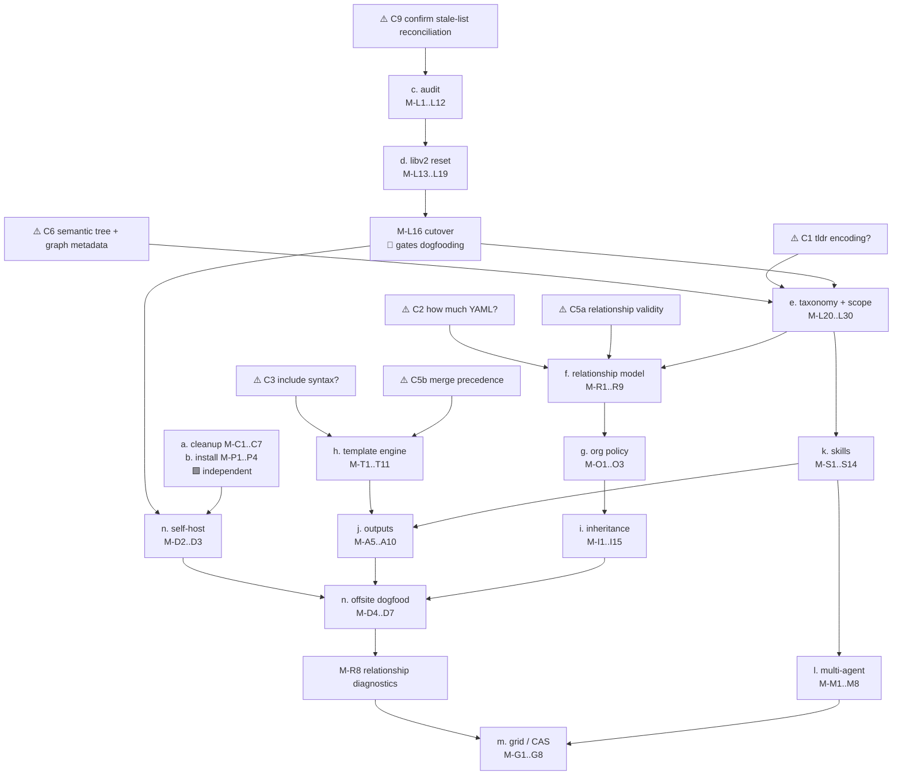

# TODO Index

| Handle | Title | Status |
|--------|-------|--------|
| jusuk | Mogent: Modular Agent Prompt Manager | [open](TODO-jusuk-mogent-agent-modules.md) |
| pickup-2026-08-25-libv2-intake | Current libv2 intake checkpoint | [active](PICKUP-2026-08-25-libv2-intake.md) |
| pickup-2026-08-05-library-split | Historical library split checkpoint | [historical](PICKUP-2026-08-05-library-split.md) |

## Canonical Mogent Task List

Migrated provisionally from `~/dev/Notes/inbox/2026-08-W34.md` on
2026-08-25. Cross-project owner decisions C1-C7 and C9 remain in that weekly
note; this file owns the detailed M-* work items and dependency graph.

Canonical repository tracking:

- `~/dev/cdint/Agents/libv2-proto/WORKLIST.md`
- `~/dev/cdint/Agents/TODO/PICKUP-2026-08-25-libv2-intake.md`
- `~/dev/cdint/Agents/docs/LIBV2-PROTO-PROGRESS-REPORT.md`
- Include/composition narrowing: `~/dev/cdint/Agents/docs/thought-experiments/TE-nufad-module-includes.md`

- **Done**
	- [x] Split the large CLI package ✅ 2026-08-20
	- [x] Consolidate atomic writes into one helper ✅ 2026-08-20
	- [x] Reject Markdown symlinks during local library indexing ✅ 2026-08-20
	- [x] Publish the reusable API used by the CLI ✅ 2026-08-20
	- [x] Implement immutable URL pinning and pinned subdirectories ✅ 2026-08-20
	- [x] Replace TOML with canonical `agents.yaml`, explicit source aliases, manifest-relative local paths ✅ 2026-08-20
	- [x] Delete the bad repo `AGENTS.md` ✅ 2026-08-21
	- [x] Remove inferred agents from the source agents file ✅ 2026-08-21
	- [x] **M-I14** Gitea login confirmed ✅ 2026-08-25
- **a. Implementation cleanup**
	- [ ] 🟩 **M-C1** Finish the ignored-cleanup-error audit
	- [ ] 🟥 **M-C2** Distinguish infallible hash writes from cleanup failures that must be joined or reported — after M-C1
	- [ ] 🟩 **M-C3** Finish the public Go API compatibility review
	- [ ] 🟥 **M-C4** Write package documentation — after M-C3
	- [ ] 🟥 **M-C5** Write external-style examples — after M-C3
	- [ ] 🟩 **M-C6** Merge outstanding branches
	- [ ] 🟩 **M-C7** Restructure remaining directories (carryover from the CLI split)
- **b. Portable install**
	- [x] **M-P1** Remove the runtime `rg` dependency ✅ 2026-08-25 — `rg` remains only a development-shell convenience
	- [x] **M-P2** Remove the supported-install `gcc` requirement ✅ 2026-08-25 — `tools/install` uses `CGO_ENABLED=0`
	- [x] **M-P3** Determine the CGO dependency path ✅ 2026-08-25 — terminal dependencies reach `os/user`; documented in README
	- [ ] 🟩 **M-P4** Decide whether to add a Makefile as an ergonomic wrapper around the existing pure-Go install/check scripts — no longer a portability blocker
- **c. Library v2 — audit** (all gated on ⚠️ C9)
	- [x] **M-L1** Complete the initial read of every checked-in module under `libraries/` ✅ 2026-08-25 — owner review continues through semantic intake
	- [ ] 🟨 **M-L2** Record per module: missing, thin, duplicated, conflicting, or overly repo-specific content
	- [ ] 🟩 **M-L3** Survey existing `AGENTS.md` files across all relevant repos ⏰ OVERDUE
	- [ ] 🟩 **M-L4** Pull examples from [Steve's brainstorm doc and dumps](https://github.com/stevegt/quincy-agents/tree/main/docs) ⏰ OVERDUE
	- [ ] 🟩 **M-L5** Pull examples from websites and Promise Grid repos ⏰ OVERDUE
	- [ ] 🟨 **M-L6** Complete heading-level comparison against the 37 protected source guides — category-level pass is done; exhaustive mapping remains
	- [ ] 🟨 **M-L7** Complete heading-level dispositions for missing, conflicting, duplicate, generated, repository-local, and rejected material — initial audit and ledger exist
	- [ ] 🟩 **M-L8** Review the latest generated [AGENTS.md](https://github.com/Qu1ncyRy4n/Agents/blob/main/AGENTS.md) and its [source list](https://github.com/Qu1ncyRy4n/Agents/blob/main/docs/existing-agents.txt)
	- [ ] 🟥 **M-L9** Fix the LLM's over-generalization: it summarized to lowest common denominator instead of concatenating — after M-L8
	- [ ] 🟨 **M-L10** Correct backwards content throughout intake — TE narrowing correction exists and is pending owner review
	- [x] **M-L11** Include all experimental/generated source guides in exhaustive review with explicit authority labels ✅ 2026-08-25
	- [ ] 🟥 **M-L12** Decide: narrow, specific agents vs. one catch-all agent file — after M-L9
- **d. Library v2 — migration and cleanup**
	- [ ] 🟨 **M-L13** Run the libv2-proto reset to completion
	- [ ] 🟨 **M-L14** Keep every module until explicitly discussed (migration rule — enforce, don't drop silently)
	- [ ] 🟨 **M-L15** Maintain the semantically-organized intake folder for finding and negotiating overlap
	- [ ] 🟥 **M-L16** Cut libv2-proto over to libv2 — after M-L13, gates all dogfooding per C10
	- [ ] 🟥 **M-L17** Delete the old library repo — after M-L16
	- [x] **M-L18** Remove the rejected explanatory additions from the v1 cleanup ✅ 2026-08-20 — preserved in commit `86780a0`
	- [x] **M-L19** Remove `corpus-variants` IDs and verify no checked-in manifest references them ✅ 2026-08-20
- **e. Library v2 — structure and conventions**
	- [ ] 🟥 **M-L20** Approve the module-boundary convention: compatible bundles stay together; optional or exclusive choices become atomic files — needs ⚠️ C2
	- [ ] 🟥 **M-L21** Adopt the new bundling / optional-module convention — after M-L20
	- [x] **M-L22** Adopt descriptive titles that state opinion and outcome for v2 intake candidates ✅ 2026-08-25
	- [ ] 🟥 **M-L23** Reorganize the library taxonomy — needs ⚠️ C6
	- [ ] 🟥 **M-L24** Fill missing and underdeveloped library sections — after M-L23
	- [ ] 🟩 **M-L25** Nail down what belongs in an `AGENTS.md` at all
	- [ ] 🟥 **M-L26** Separate architectural considerations out of `AGENTS.md` — after M-L25
	- [ ] 🟥 **M-L27** Separate Go-language idiosyncrasies out of `AGENTS.md` — after M-L25
	- [ ] 🟥 **M-L28** Move content out of `AGENTS.md` into skills, docs, and research/primary-source docs — after M-L25
	- [ ] 🟩 **M-L29** Decide whether the descriptive-comment workflow belongs in the reusable library — LLM writes full intent, human trims to the durable explanation
	- [ ] 🟥 **M-L30** Implement the chosen TLDR representation — needs ⚠️ C1
- **f. Metadata and relationship model** — whole group gated on ⚠️ C2 and ⚠️ C5a
	- [ ] 🟥 **M-R1** Settle the frontmatter/`library.yaml` split
	- [ ] 🟥 **M-R2** Add heading-level metadata only if dogfooding proves it necessary
	- [ ] 🟥 **M-R3** Replace `alternative_family` with `exclusive_group`
	- [ ] 🟥 **M-R4** Define `requires`, `conflicts_with`, `exclusive_group`, `requires_one_of`, `see_also`
	- [ ] 🟥 **M-R5** Keep intrinsic relationships source-local via `self:`; defer cross-library relationships
	- [ ] 🟥 **M-R6** Implement the chosen prerequisite/resolution rule
	- [ ] 🟥 **M-R7** Decide migration behavior for renamed or moved source paths
	- [ ] 🟥 **M-R8** Dogfood relationship diagnostics before stabilizing the metadata format — after M-D5
	- [x] **M-R9** Write up provisional relationship semantics in the libv2-proto progress report ✅ 2026-08-25 — implementation decisions remain open
	- Deferred until concrete use cases appear: generalized logical operators, urgency metadata, provenance links, cross-library policy
- **g. Organization policy** — after the relationship model
	- [ ] 🟥 **M-O1** Decide required-bundle syntax and the authority boundary
	- [ ] 🟥 **M-O2** Decide between explicit per-repo policy and a separately trusted pinned profile
	- [ ] 🟩 **M-O3** Settle personal vs. org vs. repo-specific source precedence (CIWG vs. pg vs. personal) — personal sources only make sense at repo init, never in a shared repo
- **h. Template / include engine** — gated on ⚠️ C3 and ⚠️ C4
	- [x] **M-T0** Run broad include/composition narrowing TE ✅ 2026-08-25 — `TE-nufad`; rich YAML-in-HTML rejected as default; three directions survive
	- [ ] 🟩 ⚠️ **M-T0a** Decide whether exact mid-document insertion is required for first libv2 cutover
	- [ ] 🟥 **M-T0b** If exact insertion is required, prototype frontmatter + minimal named marker versus restricted literal Go-template include — after M-T0a
	- [ ] 🟨 **M-T1** Identify the required primitives: module composition is required; exact insertion, conditionals, variable insertion, and loops still need explicit use cases
	- [ ] 🟩 **M-T2** Evaluate Go templates as the engine; prototype a thin wrapper
	- [ ] 🟥 **M-T3** Resolve the Go-template include problem — `templates` requires knowing included files up front; explore a lambda-style workaround — after M-T2
	- [ ] 🟥 **M-T4** Confirm the map-not-struct path: JSON/YAML map → Go map → execute — after M-T2
	- [ ] 🟩 **M-T5** Evaluate the C-preprocessor model (`#include` + conditionals) as the alternative
	- [ ] 🟥 **M-T6** Simplify the directive surface to a single `include` — needs ⚠️ C3
	- [ ] 🟥 **M-T7** Decide `.command` integration and whether `.include` and `.img` → md directives survive — needs ⚠️ C3
	- [ ] 🟥 **M-T8** Decide the frontmatter/data-map merge rule: immutable parent map, explicit child arguments, child overrides, or another fail-loud model — needs C3 and C5b
	- [ ] 🟥 **M-T9** Build the reference template-org example from the Aug 21 sketch — after M-T6
	- [ ] 🟩 **M-T10** Look at how the CSWG website does templating
	- [ ] 🟩 **M-T11** Look at nix's mustache rendering as a comparison point
- **i. Inheritance and reconciliation**
	- [ ] 🟥 **M-I1** Make `status` the canonical read-only report — relationship reporting needs C5a; YAML inheritance/merge reporting needs C5b
	- [ ] 🟥 **M-I2** Replace mutating `drift` modes with `preserve`, `inherit`, `propose` — after M-I1
	- [ ] 🟥 **M-I3** Design provenance v2: retain retrievable Base content — after M-I2
	- [ ] 🟥 **M-I4** Record the exact Origin revision for localized modules — after M-I3
	- [ ] 🟥 **M-I5** Define atomic updates across provenance, local content, manifest, and output — after M-I3
	- [ ] 🟥 **M-I6** Implement `preserve`: generated-output edit → repository-local source — after M-I5
	- [ ] 🟥 **M-I7** Add three-way Base/Origin/Local classification — after M-I5
	- [ ] 🟥 **M-I8** Add `--dry-run` and exact-revision acceptance — after M-I7
	- [ ] 🟥 **M-I9** Apply only fast-forward updates initially — after M-I7
	- [ ] 🟥 **M-I10** Design reviewed non-overlapping merges and explicit replace-local behavior — after M-I9
	- [ ] 🟥 **M-I11** Decide how `--required-only` filters centrally reviewed organization updates — after M-I9
	- [ ] 🟥 **M-I12** Implement `propose`: emit a transport-neutral local patch first — after M-I9
	- [ ] 🟥 **M-I13** Add optional Git branch and commit preparation to `propose` — after M-I12
	- [ ] 🟥 **M-I15** Evaluate Gitea / GitHub / GitLab / Promise Grid delivery — only after M-I12
- **j. Authoring and output surfaces**
	- [ ] 🟩 **M-A1** Add a source-declaration workflow (`mogent source add` or another reviewed surface); do not confuse it with existing `mogent add`, which selects a module
	- [ ] 🟩 **M-A2** Add guided module creation
	- [ ] 🟩 **M-A3** Add module move and manifest reorder workflows
	- [ ] 🟩 **M-A4** Add user-level `display.hints` plus `--hints` / `--no-hints`
	- [ ] 🟥 **M-A5** Define explicit `CLAUDE.md` output — after the template engine
	- [ ] 🟥 **M-A6** Define `GEMINI.md` and other agent-specific outputs — after M-A5
	- [ ] 🟥 **M-A7** Define `SPEC.md` output — universal/portable principles closer to code and implementation than to process and design — after M-A5
	- [ ] 🟥 **M-A8** Define a research docs target: DI/DR/TE plus web-search summaries, so agents don't re-scrape — after M-A5
	- [ ] 🟥 **M-A9** Define a lang/lib docs target: reduced, streamlined, locally-stored docs (matplotlib, psychopy are heavy, unmodular token sinks) — after M-A5
	- [ ] 🟥 **M-A10** Build `mogent search --tags "rust/tests" "tests"` — tag-driven retrieval across agents, docs, spec, and skills — after M-A8
	- [ ] ⬜ **M-A11** Investigate full chat-context portability so machines can be switched mid-session
- **k. Skills research**
	- [ ] 🟩 **M-S1** Determine what is server-side, in-model, and in-tool, including server-side caching ⏰ OVERDUE
	- [ ] 🟩 **M-S2** Review existing skills and agents files in Gitea
	- [ ] 🟩 **M-S3** Review Steve's agent skill
	- [ ] 🟩 **M-S4** Review Steve's "consensus" skill — parallel LLM work with no single authoritative bottleneck agent
	- [ ] 🟩 **M-S5** Review the thought-experiment skill in cdint-grid
	- [ ] 🟩 **M-S6** Review Codex, Claude Code, Gemini CLI, Copilot, Cursor, OpenCode, and Goose skill systems from primary docs
	- [ ] 🟥 **M-S7** Compare discovery scope, trust, dependencies, pinning, precedence, installation, interoperability — after M-S6
	- [ ] 🟩 **M-S8** Browse community skills at [skills.sh](https://skills.sh) and [mattpocock/skills](https://github.com/mattpocock/skills)
	- [ ] 🟩 **M-S9** Watch [How To Use AI Skills Like A Senior Developer](https://www.youtube.com/watch?v=cxQLKsktiBA)
	- [ ] 🟩 **M-S10** Review findings from Steve's agent researching skills optimization and token-cost reduction
	- [ ] 🟩 **M-S11** Reference [cdint-grid](https://gitea.t7a.org/cdint/cdint-grid) for LLMs calling custom tools via skills — `AGENTS.md` and `.agents/*` entry points
	- [ ] 🟥 **M-S12** Decide whether Mogent should compose, install, inventory, or project skills into ecosystem-specific formats — after M-S7
	- [ ] 🟥 **M-S13** Decide the always-present vs. loaded-on-demand boundary — commit a skill instead of putting it in `AGENTS.md` — after M-S7
	- [ ] 🟥 **M-S14** Evaluate the "Mogent skill" idea — an LLM-facing skill that pulls docs and relevant issues by tag — after M-S12
- **l. Multi-agent coordination** — todo app is the intended substrate per ⚠️ C12
	- [ ] 🟩 **M-M1** Explore multi-agent setup management in Mogent
	- [ ] 🟩 **M-M2** Evaluate a communication watch file
	- [ ] 🟥 **M-M3** Wire the todo-list app in as the coordination layer — after T4
	- [ ] 🟩 **M-M4** Evaluate promise-style coordination semantics
	- [ ] 🟩 **M-M5** Design the async-cue pattern: worker A waits on worker B; tmp inbox dir tree; grid messages instead of an unremindable todo file
	- [ ] 🟩 **M-M6** Get message-passing context for the Mogent repo specifically
	- [ ] 🟥 **M-M7** Define the essential minimal proof that parallel coordination works under Promise Theory rules — after M-M4, M-M5
	- [ ] 🟥 **M-M8** Decide whether multi-agent governance belongs in Mogent or a separate tool — after M-M7
- **m. Grid / CAS future**
	- [ ] 🟩 **M-G1** Look at CAS storage from Promise Grid
	- [ ] 🟥 **M-G2** Determine what Mogent looks like if fragments live in CAS space — after M-G1
	- [ ] 🟥 **M-G3** Design the URL-independent path: libraries served from grid storage via the same process as the grid repo — after M-G2
	- [ ] 🟩 **M-G4** Start thinking about PG integration as early as possible
	- [ ] 🟩 **M-G5** Develop the static vs. dynamic linking analogy: Mogent builds a static library, skills sit in `.agents` and load at runtime
	- [ ] 🟩 **M-G6** Articulate the "LLM is a Markdown compiler" framing — precision in Markdown → code generation, compiler imports libraries, libraries organized and included at runtime
	- [ ] ⬜ **M-G7** Revisit embeddings for docs (aidda-style) — Steve: grid and storm will provide better-managed vector DB pieces
	- [ ] 🟩 **M-G8** Look at Swamp's hub-and-spoke JSON instructions and tight constraints; decide whether the pattern is useful here
- **n. Dogfooding** — libv2 first per ⚠️ C10, so everything here waits on M-L16
	- [ ] 🟥 **M-D1** Author the root `agents.yaml` against reviewed libv2 modules — intentionally clean-slate/TBD until M-L16
	- [ ] 🟥 **M-D2** Build the root `AGENTS.md` from the new manifest — after M-D1
	- [ ] 🟥 **M-D3** Refresh stale Git/branch facts in `docs/HANDOFF.md` — after M-D2
	- [ ] 🟥 **M-D4** Choose the offsite dogfood repo — todo app is the front-runner per C12; alternates are teacherbot/guided manual, vroca-tts, research repos — after M-L16
	- [ ] 🟥 **M-D5** Populate `docs/ACTIVE-DOGFOOD.md` with actual repositories and bounded experiments — after M-D4
	- [ ] 🟥 **M-D6** Get Mogent working for Steve in the cdint-grid repo — first outside-the-repo feedback — after M-D5
	- [ ] 🟥 **M-D7** Use Mogent on Quincy's own projects once it's good enough — after M-D5
	- [ ] 🟩 **M-D8** Look at JJ's dev guide as a reference implementation

#### Mogent dependency graph

